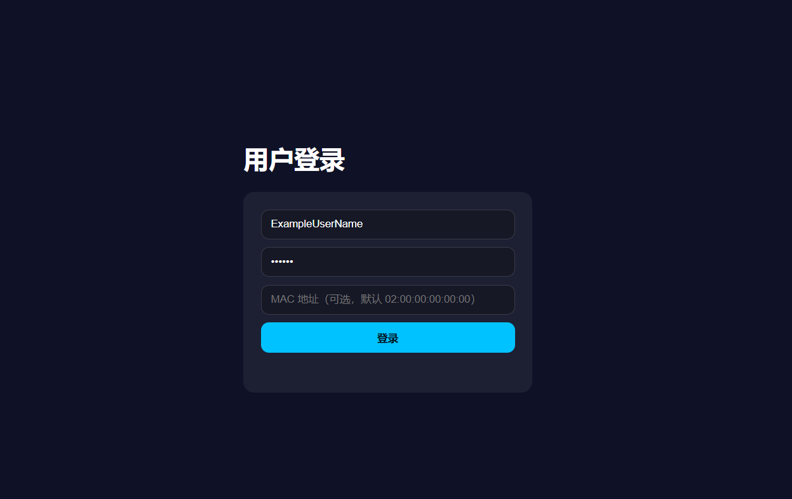
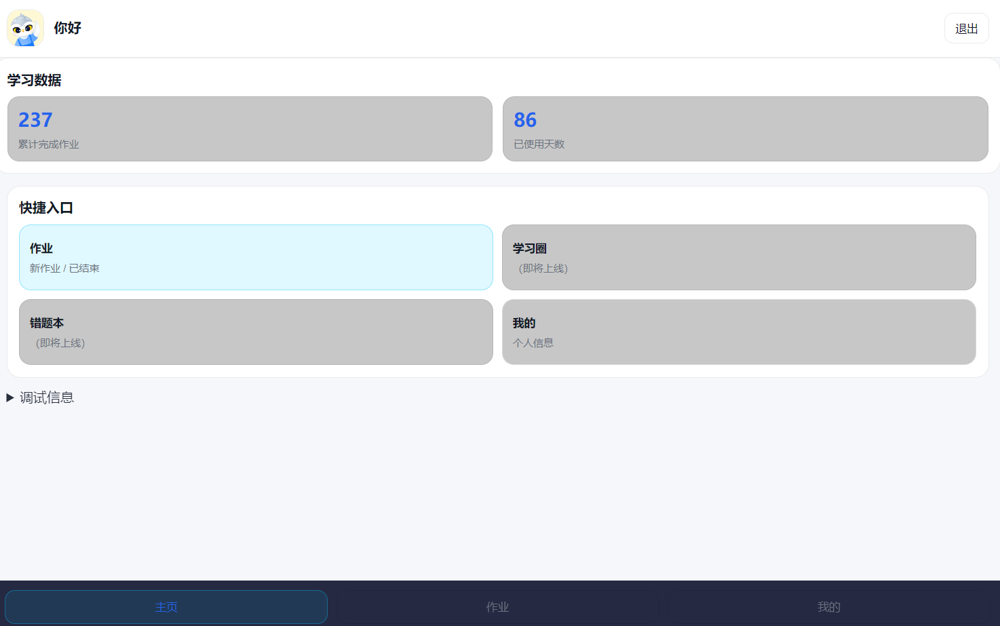
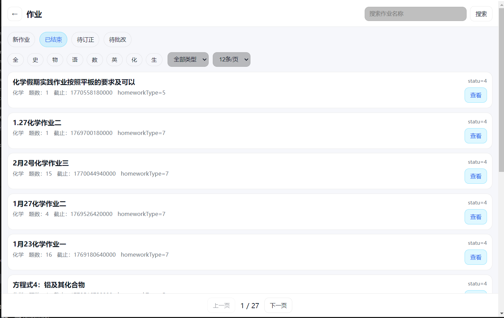
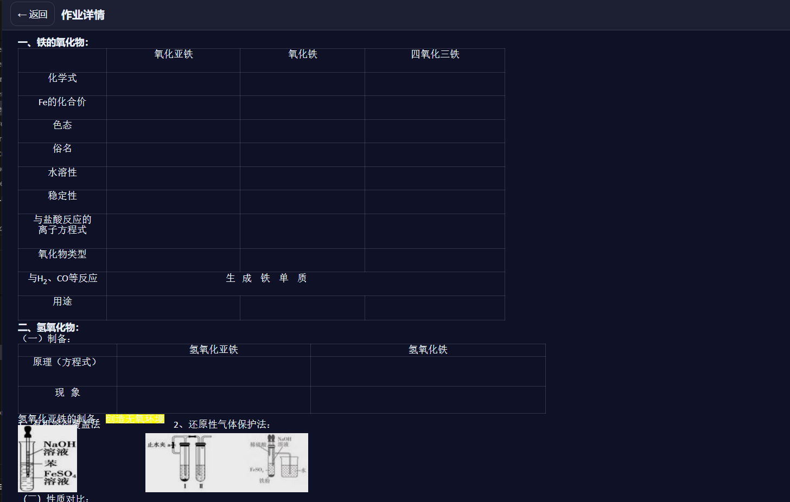

# msyk-thirdparty-pc-client-一个美师优课第三方PC客户端

旨在填补美师优课没官方pc客户端的空缺（尽管有web端）  

## Install
无需安装，解压可用
## Features
逐步完善ing，目前主要集中在查看作业和提交作业（可能）上
## Pic

## Todo  
[+]统一深浅色  
[⍻]提高信息可读性  
[-]完善关于页面  
[-]美化ui  
[-]用户协议和隐私策略  
[-]自定义背景  
[-]增加GitHub page介绍页  
[X]学习圈和错题本（可能不会开发）  
[-]Android Phone项目：`正在开发`

[+] 暂时认为完成 [⍻] 部分完成 [-] 等待完成 [X] 近期不会完成  

## Changelogs
`v0.0.1` 新建项目，使用包装web端的方法  
`v0.0.2-v0.4.2` 逐页完善，防跳转其他页面  
`v0.5.0` 支持作业查看，解决割裂体验  
`v1.0.0` 重写项目，使用android api，允许自定义设备mac，逐步支持v0.x.x的部分功能  
`v1.0.1` 添加浅色支持，可以切换深浅色，修复返回按钮无效，初始发布  
`v1.0.2` 统一深浅色样式,支持记住密码，截止时间采用可读时间替换时间戳  
`vv1.0.2-Beta-2` 支持提交作业，目前答题卡单选多选填空可以正常，其他类型正在测试  

## Documents
软件本体都没完善怎么写文档

## Bugs
很正常，开issue就行，想要新功能也可以提
编译问题尽量自己解决
使用问题及时提出

## About
兴趣开发，为了尽快落实可用UI并没美化，直接使用ai生成，后续逐步调整